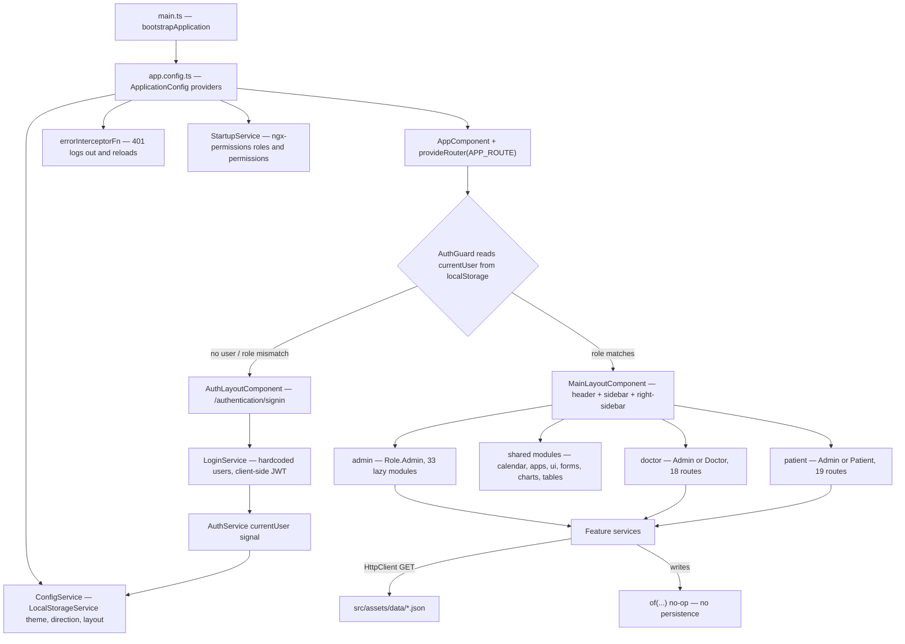

# Cliniva

Angular 21 hospital administration dashboard: a role-partitioned front-end for admin, doctor, and patient portals, built on Angular Material with mock JSON data and no backend.

<!-- [DATA NEEDED]: No CI pipeline, published package, or license file exists in the repo, so there are no verifiable status/version badges to display. -->

## Overview

Cliniva is a single-page Angular application that renders the operational surface of a hospital: appointments, patients, staff, wards, laboratory, pharmacy, billing, and roughly thirty other departments. It ships three separate portals — admin, doctor, and patient — gated by role and driven from one data-defined navigation tree.

All data is served from static JSON files under `src/assets/data/`. Authentication is an in-memory user list with a client-generated JWT. There is no server, no database, and no persistence beyond `localStorage`. Treat this repository as a front-end template and UI reference implementation, not a deployable clinical system.

The intended audience is front-end developers building or evaluating a hospital management UI, and designers who need a working reference for the layout, theming, and component conventions.

## Key features

Each capability below maps to a route module or shared component in the tree.

| Capability | Where it lives |
|---|---|
| Role-partitioned portals (`ADMIN`, `DOCTOR`, `PATIENT`) | `src/app/app.routes.ts`, `src/app/core/models/role.ts` |
| Admin portal — 33 lazy-loaded departments | `src/app/admin/admin.routes.ts` |
| Doctor portal — 18 feature routes | `src/app/doctor/doctor.routes.ts` |
| Patient portal — 19 feature routes | `src/app/patient/patient.routes.ts` |
| Authentication screens (signin, signup, forgot password, 2FA, locked, 404, 500, maintenance, coming-soon) | `src/app/authentication/auth.routes.ts` |
| Route guarding by role | `src/app/core/guard/auth.guard.ts` |
| Permission directives loaded at startup | `src/app/core/service/startup.service.ts` (via `ngx-permissions`) |
| Data-driven sidebar navigation, 89 top-level entries | `src/assets/data/routes.json`, `src/app/layout/sidebar/sidebar.service.ts` |
| Reusable CRUD table (sort, filter, select, export, paginate) | `src/app/shared/components/master-table/` — see its [README](src/app/shared/components/master-table/README.md) |
| ~100 dashboard widgets and chart cards | `src/app/shared/components/` |
| Runtime theme switcher: 7 color themes, dark mode, glassmorphism, RTL, horizontal layout | `src/app/layout/right-sidebar/right-sidebar.component.ts` |
| Translation with 8 locale bundles | `src/assets/i18n/`, `src/app/core/service/language.service.ts` |
| Optional AI assistant (OpenAI or Gemini, user-supplied key) | `src/app/core/service/ai.service.ts`, `src/app/layout/components/ai-chat-assistant/` |
| Global command-palette search | `src/app/layout/components/global-search/` |
| FullCalendar scheduling | `src/app/calendar/`, `src/app/admin/appointment/appointment-calendar/` |
| Bundled demo apps: chat, kanban, file manager, email, contacts, tasks, support | `src/app/apps/`, `src/app/email/`, `src/app/contacts/`, `src/app/task/` |
| UI kit and chart galleries | `src/app/ui/`, `src/app/charts/`, `src/app/forms/`, `src/app/tables/`, `src/app/icons/` |
| PWA: service worker + web manifest | `ngsw-config.json`, `src/manifest.webmanifest` |
| Excel export | `src/app/shared/tableExportUtil.ts` (`exceljs`, `file-saver`) |

## Architecture

The application is a fully client-side SPA. Every "API" call resolves to a static JSON asset or an RxJS `of()` stub.



Layer responsibilities:

| Layer | Responsibility |
|---|---|
| Bootstrap (`src/main.ts`, `src/app/app.config.ts`) | Standalone bootstrap. Registers zoneless change detection, router, HTTP with interceptor, translation, permissions, date adapter, charts, service worker, and a tree-shaken icon set. |
| Routing (`src/app/app.routes.ts` + 54 child route files) | Two shells — `MainLayoutComponent` (guarded) and `AuthLayoutComponent`. Everything below the shell is lazy-loaded. |
| Core (`src/app/core/`) | Cross-cutting singletons: auth, token, JWT, startup permissions, language, direction, HTTP error interceptor, role model. |
| Layout (`src/app/layout/`) | Chrome: header, sidebar (vertical and horizontal), right settings sidebar, page loader, global search, AI assistant, notification and profile menus. |
| Feature modules (`admin/`, `doctor/`, `patient/`, and siblings) | Self-contained standalone components with a colocated `*.service.ts`, `*.model.ts`, and `dialogs/` folder per CRUD area. |
| Shared (`src/app/shared/`) | Presentational widgets, `MasterTableComponent`, export utilities, storage service, table animations. |
| Styles (`src/assets/scss/`) | Global SCSS: variables, mixins, components, pages, plugins, UI kit, and nine theme files. |
| Data (`src/assets/data/`) | Static JSON standing in for a backend. |

## Platform structure

```
.
├── angular.json                  Build/serve/test/lint targets for the single `cliniva` project
├── eslint.config.js              Flat ESLint config — @angular-eslint + typescript-eslint
├── ngsw-config.json              Service worker asset groups (production builds only)
├── tsconfig.json                 Strict TS + strictTemplates; @core/@shared/@config path aliases
├── tsconfig.app.json             App compilation target
├── tsconfig.spec.json            Test compilation target
├── .npmrc                        legacy-peer-deps=true — required for install to resolve
├── public/                       PWA icons and a manifest copy (not referenced by angular.json assets)
└── src/
    ├── index.html                Document shell; loads Roboto + Material Icons from Google Fonts
    ├── main.ts                   bootstrapApplication(AppComponent, appConfig)
    ├── styles.scss               Global stylesheet stub (currently empty)
    ├── manifest.webmanifest      PWA manifest served with the app
    ├── environments/             environment.ts / environment.development.ts — currently unreferenced
    ├── assets/
    │   ├── data/                 Static JSON "API" responses, one per feature
    │   ├── i18n/                 Translation bundles: ar, de, en, es, fr, hi, pt, zh
    │   ├── images/               Avatars, banners, flags, gallery, product and page imagery
    │   ├── fonts/                FontAwesome, Poppins, Themify, Simple Line Icons, iconfont
    │   └── scss/                 Global stylesheet source (see Design documentation)
    └── app/
        ├── app.component.ts      Root shell; scroll reset on navigation
        ├── app.config.ts         All application providers
        ├── app.routes.ts         Top-level route table and role gating
        ├── core/                 Guards, interceptor, models, providers, singleton services
        ├── config/               ConfigService — default layout/theme configuration
        ├── shared/               Reusable widgets, MasterTableComponent, storage, export utils
        ├── layout/               App shells, header, sidebars, page loader, global search, AI chat
        ├── admin/                33 lazy-loaded admin departments
        ├── doctor/               Doctor portal — 18 routes
        ├── patient/              Patient portal — 19 routes
        ├── authentication/       Signin, signup, password reset, 2FA, error and status pages
        ├── apps/                 Chat, kanban, file manager, drag-drop, contact grid, support
        ├── calendar/             FullCalendar scheduling view
        ├── charts/               ApexCharts, Chart.js, ECharts, ngx-charts, gauge galleries
        ├── contacts/             Contact list and form demo
        ├── email/                Inbox, compose, read-mail demo
        ├── task/                 Task board demo
        ├── forms/                Form control, validation, wizard, and editor galleries
        ├── tables/               Basic, Material, and ngx-datatable galleries
        ├── ui/                   Material/Bootstrap primitive gallery
        ├── icons/                Material and FontAwesome icon galleries
        ├── widget/               Chart and data widget galleries
        ├── timeline/             Timeline layout demos
        ├── extra-pages/          Profile, pricing, FAQ, invoice, policy, knowledge base
        └── multilevel/           Nested-routing demo
```

## Tech stack

| Layer | Technology | Version | Where configured |
|---|---|---|---|
| Framework | Angular (standalone, zoneless) | ^21.0.3 | `package.json`, `src/app/app.config.ts` |
| Language | TypeScript (`strict`, `strictTemplates`) | ~5.9.3 | `tsconfig.json` |
| Build system | `@angular/build:application` (esbuild) | ^21.0.2 | `angular.json` |
| CLI | Angular CLI | ~21.0.2 | `package.json` |
| Package manager | npm (lockfile v3, `legacy-peer-deps`) | 10.x | `package-lock.json`, `.npmrc` |
| Component library | Angular Material + CDK | ^21.0.2 | `src/app/app.config.ts`, `angular.json` styles |
| CSS framework | Bootstrap | ^5.3.7 | imported in `src/assets/scss/style.scss` |
| Styling | SCSS | — | `angular.json` (`inlineStyleLanguage`), `src/assets/scss/` |
| Routing | `@angular/router` with `HashLocationStrategy` | ^21.0.3 | `src/app/app.config.ts` |
| State | Angular signals + RxJS | rxjs ~7.8.2 | `src/app/core/service/auth.service.ts` |
| Auth | In-memory users + client-side JWT | — | `src/app/core/service/login.service.ts`, `src/app/core/service/JWT.ts` |
| Permissions | `ngx-permissions` | ^19.0.0 | `src/app/app.config.ts`, `src/app/core/service/startup.service.ts` |
| i18n | `@ngx-translate/core` + http-loader | ^17.0.0 | `src/app/app.config.ts`, `src/assets/i18n/` |
| Dates | `date-fns` + Material date-fns adapter | ^4.4.0 | `src/app/app.config.ts` |
| Charts | ApexCharts, Chart.js/ng2-charts, ECharts, ngx-charts, ngx-gauge | see `package.json` | `src/app/charts/`, `angular.json` scripts |
| Tables | Angular Material table, `@swimlane/ngx-datatable` | ^22.0.0 | `angular.json` styles, `src/app/tables/` |
| Calendar | FullCalendar | ^6.1.19 | `src/app/calendar/` |
| Icons | `angular-feather` (tree-shaken set), Material Icons, FontAwesome | ^6.5.1 | `src/app/app.config.ts`, `src/assets/scss/fonts/` |
| Export | `exceljs` + `file-saver` | ^4.4.0 / ^2.0.5 | `src/app/shared/tableExportUtil.ts` |
| PWA | `@angular/service-worker` | ^21.0.3 | `ngsw-config.json`, `src/app/app.config.ts` |
| Testing | Karma + Jasmine | ~6.4.4 / ~5.9.0 | `angular.json` test target, `tsconfig.spec.json` |
| Linting | ESLint 9 flat config | ^9.34.0 | `eslint.config.js` |
| Data source | Static JSON | — | `src/assets/data/` |

## Getting started

### Prerequisites

| Requirement | Version | Notes |
|---|---|---|
| Node.js | 20.19+, 22.12+, or 24+ | <!-- [ASSUMED]: no `engines` field or `.nvmrc` exists in the repo; this is the range Angular 21 requires. Install verified on Node v22.22.2. --> |
| npm | 10.x or newer | Ships with the Node versions above |
| Git | any recent version | — |

### Install

```bash
git clone https://github.com/ssmith129/Cliniva-Angular.git
cd Cliniva-Angular
npm install
```

`.npmrc` sets `legacy-peer-deps=true`. Do not remove it — the dependency graph does not resolve under npm's strict peer resolution.

### Environment variables

**This application reads no environment variables.** There is no `.env` file, no `.env.example`, and no build-time variable substitution.

Two environment files exist but are not imported by any source file:

| File | Contents | Status |
|---|---|---|
| `src/environments/environment.ts` | `production: true`, `apiUrl: 'http://localhost:4200'` | Unreferenced. Swapped by `angular.json` `fileReplacements` in the development configuration, but no module imports it. |
| `src/environments/environment.development.ts` | `production: false`, `apiUrl: 'http://localhost:4200'` | Unreferenced, as above. |

<!-- [VERIFY]: confirm whether the environments/ files are intentional scaffolding for a future backend or dead code to remove. -->

Runtime configuration lives in code, not in the environment:

| Setting | Default | Source |
|---|---|---|
| Layout direction, theme color, dark mode, sidebar state, glassmorphism | `light` / `white` / `solid` / LTR | `src/app/config/config.service.ts` |
| Fallback language | `en` | `src/app/app.config.ts` |
| AI provider and API key | none — demo mode | Entered in the UI, stored in `localStorage` under `cliniva_ai_config` (`src/app/core/service/ai.service.ts`) |

### Run

```bash
npm start
```

Serves the development configuration on `http://localhost:4200/`. Because the app uses `HashLocationStrategy`, routes appear as `http://localhost:4200/#/admin/dashboard/main`.

### Verify

1. The browser lands on `#/authentication/signin` — the root path redirects there and `AuthGuard` blocks unauthenticated access.
2. Sign in with one of the demo accounts defined in `src/app/core/service/login.service.ts`:

   | Role | Username | Password |
   |---|---|---|
   | Admin | `clinivaAdmin` | `admin@123` |
   | Doctor | `doctor` | `doctor@123` |
   | Patient | `patient` | `patient@123` |

   These are hardcoded demo credentials for a mock login with no server. They are not secrets.
3. The sidebar renders the entries in `src/assets/data/routes.json` filtered to the signed-in role.
4. Open the right-hand settings panel and switch theme color or dark mode; the selection persists across reloads via `localStorage`.

## Development workflow

### Scripts

Every script below is defined in `package.json`.

| Command | Underlying target | Purpose |
|---|---|---|
| `npm start` | `ng serve` | Dev server on port 4200, development configuration, source maps on, optimization off |
| `npm run build` | `ng build` | Production build by default (`defaultConfiguration: production` in `angular.json`) → `dist/cliniva` |
| `npm test` | `ng test` | Karma + Jasmine, 287 spec files — **currently fails to compile**, see [Testing](#testing) |
| `npm run lint` | `ng lint` | ESLint over `src/**/*.ts` and `src/**/*.html` |
| `npm run ng -- <args>` | `ng` | Direct CLI passthrough, e.g. `npm run ng -- generate component foo` |

Useful non-scripted invocations:

```bash
npx ng build --configuration development   # unminified build with source maps
npx ng test --watch=false --browsers=ChromeHeadless
npx ng lint --fix
npx ng generate component admin/<feature>/<name>
```

There is no `format` script and no Prettier configuration in the repo. Formatting is whatever your editor applies.

### Branching and commits

<!-- [DATA NEEDED]: the repository has no CONTRIBUTING.md, commit template, git hooks, or CI enforcing a convention, and the existing history is unstructured. Document the team's actual branch naming and commit message convention here. -->

### Testing

Specs sit beside their components as `*.spec.ts` (287 of them). The test target is configured in `angular.json` under `projects.cliniva.architect.test`, using `@angular/build:karma` with `tsconfig.spec.json`.

```bash
npm test                                     # watch mode, launches Chrome
npx ng test --watch=false --code-coverage    # single run, coverage to ./coverage
```

> **The suite does not currently compile.** `ng test` fails during the build step with 50 TypeScript errors across 49 spec files, so zero tests execute. The failures are stale specs, not product bugs — the application builds and lints clean. Three categories:
>
> - Specs importing symbols that were renamed or removed (`FormDialogComponent`, `DeleteComponent`, `AllholidayComponent` vs. `AllHolidayComponent`, and similar) — the bulk of them, concentrated in `dialogs/form-dialog/` and `dialogs/delete/` spec files.
> - Specs importing `async` from `@angular/core/testing`, which no longer exports it (use `waitForAsync`).
> - Type drift: `TableCardComponent<T>` used without its type argument; `AppComponent.title` referenced but not defined.
>
> Fix these before relying on the suite as a gate. Reproduce with `npx ng test --watch=false` and read the compiler output.

`karma-coverage` is installed, so `--code-coverage` works once the suite compiles. No coverage threshold is configured, and nothing runs the tests automatically — there is no CI.

There is no end-to-end test tooling installed. `ng e2e` will prompt to add a package and fail without one.

### Linting and formatting

`eslint.config.js` enforces:

- Component selectors: `app-` prefix, kebab-case element (`@angular-eslint/component-selector`).
- Directive selectors: `app` prefix, camelCase attribute (`@angular-eslint/directive-selector`).
- `@typescript-eslint/no-explicit-any`: **error** — `any` is not permitted.
- `@typescript-eslint/no-unused-vars`: error, with a `^_` ignore pattern for intentionally unused identifiers.
- The full `@angular-eslint/eslint-plugin-template` recommended rule set on `.html` files.

TypeScript is strict: `strict`, `noImplicitOverride`, `noPropertyAccessFromIndexSignature`, `noImplicitReturns`, `noFallthroughCasesInSwitch`, plus `strictTemplates` and `strictInjectionParameters` on the Angular compiler.

### Local debugging

- Source maps are on in the development configuration (`angular.json`), so breakpoints in `src/**` work directly in browser devtools.
- The service worker is disabled in development (`enabled: !isDevMode()` in `src/app/app.config.ts`), so there is no stale-cache interference while developing.
- Application state lives in `localStorage` under a computed prefix — `{light|dark}_{ltr_|rtl_}`, built by `LocalStorageService.getStoragePrefix()` in `src/app/shared/services/storage.service.ts`. Keys include `currentUser`, `roleNames`, `redstar-token`, `theme`, and `lang`. To reset the app, clear site data.
- Change detection is zoneless (`provideZonelessChangeDetection()`). Mutating a plain object in place will not trigger a re-render — use signals, or reassign the reference.

## Design documentation

The visual layer derives from a purchased admin template; several SCSS files carry a `RedStar Template` authorship header. There is no Figma file, Storybook instance, or design-token pipeline in the repository.

### Design system overview

Style layers stack in this order, per the `styles` array in `angular.json`:

1. Angular Material prebuilt theme `azure-blue.css`.
2. `@swimlane/ngx-datatable` base, material theme, and icon CSS.
3. `src/assets/scss/style.scss` — the project stylesheet, which imports Bootstrap 5 then the local partials.
4. `src/assets/scss/theme/all-themes.scss` — the nine switchable themes.
5. `src/styles.scss` — currently an empty stub reserved for global overrides.

`src/assets/scss/style.scss` is the index; it loads partials from `common/`, `fonts/`, `components/`, `apps/`, `pages/`, `plugins/`, and `ui/`.

### Design tokens

Tokens are SCSS variables and maps, not a JSON token file or CSS custom property system.

| Token group | Source of truth | Shape |
|---|---|---|
| Color palette | `src/assets/scss/common/_variables.scss` | `$colors` map — 15 named hex values (red, pink, purple, indigo, blue, cyan, teal, green, yellow, orange, deep-orange, brown, grey, black, white) |
| Gradients | `src/assets/scss/common/_variables.scss` | `$linear-colors` map — 14 named `linear-gradient` values |
| Theme colors | `src/assets/scss/theme/_theme-color-variables.scss` | Per-theme variables (`$theme-white-*`, `$theme-black-*`, `$theme-purple-*`, …) covering sidebar, navbar, and active/hover states |
| Typography | `src/assets/scss/common/_variables.scss` | `$navbar-font-family` and `$sidebar-font-family`, both `"Roboto", sans-serif`. Roboto and Material Icons load from Google Fonts in `src/index.html`. `<body class="mat-typography">` applies the Material type scale. |
| Spacing | `src/assets/scss/common/_helpers.scss` | Generated utilities on a **5px** step, `@for $i from -25 through 25` → `.m-l-5` … `.m-l-125`, plus `.padding-*` and `.margin-*` |
| Elevation | `src/assets/scss/common/_mixins.scss` | `@mixin box-shadow($shadowinfo)` — a vendor-prefix helper, not a defined elevation scale. Material components use Material's own elevation. |
| Motion | `src/assets/scss/common/_animation.scss`, `_customanimate.scss`; `@mixin transition()` in `_mixins.scss`; `src/app/shared/table.animations.ts` | Keyframe and transition definitions. No named duration or easing scale. |

<!-- [VERIFY]: there is no single canonical token file. If a token pipeline is planned, _variables.scss (38 lines) is the natural seed — it currently defines only colors, gradients, and two font families. -->

### Component library

| Location | Contents |
|---|---|
| `src/app/shared/components/` | ~100 presentational widgets: stat cards, chart cards, dashboard panels, skeleton loader, breadcrumb, file upload, activity lists |
| `src/app/shared/components/master-table/` | `MasterTableComponent` — the standard CRUD table. Fully documented in [its README](src/app/shared/components/master-table/README.md): 16 inputs, 6 outputs, 11 column types, status-badge maps, Excel export |
| `src/app/ui/` | Live gallery of the Material and Bootstrap primitives — alerts, badges, buttons, cards, chips, dialogs, expansion panels, lists, modals, preloaders, progress bars, snackbars, tabs, typography — routed under `#/ui/*` |
| `src/app/forms/`, `src/app/tables/`, `src/app/charts/`, `src/app/icons/` | Galleries for form controls, tables, all five charting libraries, and the icon sets |

Components are standalone. Import what you need directly; there are no shared `NgModule`s.

### Theming and dark mode

Defaults are set in `src/app/config/config.service.ts`; runtime switching is handled by `src/app/layout/right-sidebar/right-sidebar.component.ts`, which toggles classes on `<body>` and persists the choice to `localStorage`.

| Option | Values | Body class applied |
|---|---|---|
| Theme color | `white`, `black`, `purple`, `blue`, `cyan`, `green`, `orange` | `theme-<name>` |
| Variant | `light`, `dark` | `light` / `dark` |
| Sidebar | `light`, `dark` | `menu_light` / `menu_dark` |
| Layout style | `solid`, `glassmorphism` | `layout-glassmorphism` |
| Glassmorphism background | `purple-blue`, `sunset`, `mint`, `candy`, `ocean`, `yellow`, `lush` | gradient applied inline |
| Direction | LTR, RTL | driven by `DirectionService` and `AppDirectionality`; styles in `src/assets/scss/common/_rtl.scss` |
| Orientation | vertical, horizontal | `src/app/layout/sidebar/horizontal-sidebar/` |

Theme sources are one file per theme in `src/assets/scss/theme/`, aggregated by `all-themes.scss`. Dark mode is `_dark.scss` (`body.dark { background-color: #232b3e; }` plus overrides). All nine themes compile into the bundle, so adding a theme increases CSS weight for every user.

### Accessibility

<!-- [DATA NEEDED]: no WCAG conformance target is stated anywhere in the repo, and no accessibility linting, axe integration, or audit report exists. Set and record the target level. -->

What is verifiable today:

- Roughly 132 of 569 templates use `aria-label` or an explicit `role` attribute.
- Angular Material and the Angular CDK supply keyboard interaction, focus management, and ARIA semantics for the primitives the app builds on.
- `MAT_DIALOG_DEFAULT_OPTIONS` sets `autoFocus: false` globally (`src/app/app.config.ts`), which suppresses Material's default focus-into-dialog behavior. Dialogs must therefore manage their own initial focus.
- `src/assets/scss/common/_media.scss` enforces a `min-width: 44px` touch target below 576px.
- No skip-link and no `prefers-reduced-motion` handling exist anywhere in `src/`.
- No automated accessibility check runs. The `@angular-eslint` template recommended set is enabled, which includes some a11y rules, but there is no axe or Lighthouse gate.

### Responsive breakpoints

Breakpoints are hardcoded media queries in `src/assets/scss/common/_media.scss`, not variables. Bootstrap 5's own grid breakpoints also apply through the imported CSS.

| Range | Target |
|---|---|
| `min-width: 1281px` | Large desktop |
| `1025px – 1280px` | Desktop / laptop |
| `max-width: 1025px` | Sidebar collapse threshold |
| `768px – 1024px` | Tablet |
| `481px – 767px` | Large phone |
| `320px – 480px` | Phone |
| `max-width: 576px` | Touch-target and compact overrides |
| `max-width: 280px` | Smallest supported width |

## Tutorials

### 1. First-run setup

**Goal:** get the app running locally and signed in as each role.

**Prerequisites:** Node 20.19+/22.12+/24+, npm 10+, Git.

1. Clone and install:

   ```bash
   git clone https://github.com/ssmith129/Cliniva-Angular.git
   cd Cliniva-Angular
   npm install
   ```

2. Start the dev server:

   ```bash
   npm start
   ```

3. Open `http://localhost:4200/`. You are redirected to `#/authentication/signin`.
4. Sign in as `clinivaAdmin` / `admin@123`. The admin sidebar renders and you land in the admin portal.
5. Sign out from the profile menu, then repeat with `doctor` / `doctor@123` and `patient` / `patient@123` to see the other two navigation trees.

**Expected result:** three distinct portals, each showing only the sidebar entries whose `role` array in `src/assets/data/routes.json` includes the signed-in role.

**Common failures:**

| Symptom | Cause | Fix |
|---|---|---|
| `npm install` fails with `ERESOLVE` | `.npmrc` was removed or overridden | Restore `legacy-peer-deps=true`, or run `npm install --legacy-peer-deps` |
| Sidebar is empty after login | `assets/data/routes.json` failed to load | Check the network tab; confirm `src/assets` is in the `assets` array in `angular.json` |
| Redirected to signin immediately after signing in | Stale or mismatched `localStorage` entry | Clear site data for `localhost:4200` and sign in again |
| Blank page with a module load error in the console | Node version below the Angular 21 minimum | Switch to a supported Node release and reinstall |

### 2. Add a new admin feature module end to end

**Goal:** add a routed admin department with a list view, mock data, and a sidebar entry.

**Prerequisites:** the app runs locally (tutorial 1).

1. Generate the component:

   ```bash
   npx ng generate component admin/vaccination/vaccination-list --style=scss
   ```

2. Add a mock data file at `src/assets/data/vaccination.json` — an array of objects matching the model you are about to define.
3. Create `src/app/admin/vaccination/vaccination-list/vaccination.model.ts` with an interface for those objects.
4. Create `src/app/admin/vaccination/vaccination-list/vaccination.service.ts`, following the pattern in `src/app/admin/appointment/viewappointment/appointment.service.ts`:

   ```typescript
   import { Injectable, inject } from '@angular/core';
   import { HttpClient } from '@angular/common/http';
   import { Observable } from 'rxjs';
   import { Vaccination } from './vaccination.model';

   @Injectable({ providedIn: 'root' })
   export class VaccinationService {
     private httpClient = inject(HttpClient);
     private readonly API_URL = 'assets/data/vaccination.json';

     getAll(): Observable<Vaccination[]> {
       return this.httpClient.get<Vaccination[]>(this.API_URL);
     }
   }
   ```

5. Create `src/app/admin/vaccination/vaccination.routes.ts`:

   ```typescript
   import { Route } from '@angular/router';

   export const VACCINATION_ROUTE: Route[] = [
     { path: '', redirectTo: 'list', pathMatch: 'full' },
     {
       path: 'list',
       loadComponent: () =>
         import('./vaccination-list/vaccination-list.component').then(
           (m) => m.VaccinationListComponent
         ),
     },
   ];
   ```

6. Register it in `src/app/admin/admin.routes.ts`:

   ```typescript
   {
     path: 'vaccination',
     loadChildren: () =>
       import('./vaccination/vaccination.routes').then((m) => m.VACCINATION_ROUTE),
   },
   ```

7. Add the sidebar entry to `src/assets/data/routes.json`, matching the shape defined by `RouteInfo` in `src/app/layout/sidebar/sidebar.metadata.ts` — every field is required, and `role` must include `"ADMIN"`.
8. Verify:

   ```bash
   npx ng lint
   npx ng build --configuration development
   ```

**Expected result:** `#/admin/vaccination/list` renders, and the entry appears in the sidebar for the admin role only.

**Common failures:**

| Symptom | Cause | Fix |
|---|---|---|
| Sidebar entry does not appear | Missing field in the `routes.json` object, or `role` omits `"ADMIN"` | Match every property in the `RouteInfo` interface |
| Route resolves to the 404 page | Path registered in the wrong route file, or the exported const name does not match the `.then()` accessor | Confirm the export name in `vaccination.routes.ts` matches the import |
| Lint fails on `no-explicit-any` | Untyped service response | Type the observable with your model interface |
| Data loads in dev but 404s after build | JSON not under `src/assets/` | Only `src/assets` is copied by the `assets` array in `angular.json` |

### 3. Build a CRUD screen with `MasterTableComponent`

**Goal:** replace hand-written table markup with the shared table, gaining sort, filter, selection, pagination, and Excel export.

**Prerequisites:** a feature component and service from tutorial 2.

1. Import the component into your standalone component's `imports` array:

   ```typescript
   import { MasterTableComponent } from '@shared/components/master-table/master-table.component';
   ```

2. Declare column definitions. Available types: `text`, `date`, `time`, `phone`, `email`, `address`, `status`, `nameWithImage`, `check`, `actionBtn`, `custom`.

   ```typescript
   columnDefinitions = [
     { def: 'select', label: 'Checkbox', type: 'check', visible: true },
     { def: 'patientName', label: 'Patient', type: 'nameWithImage', visible: true },
     { def: 'vaccine', label: 'Vaccine', type: 'text', visible: true },
     { def: 'date', label: 'Date', type: 'date', visible: true },
     {
       def: 'status', label: 'Status', type: 'status', visible: true,
       statusBadgeMap: {
         Completed: 'badge badge-solid-green',
         Scheduled: 'badge badge-solid-purple',
         Overdue: 'badge badge-solid-red',
       },
     },
     { def: 'actions', label: 'Actions', type: 'actionBtn', visible: true },
   ];

   dataSource = new MatTableDataSource<Vaccination>([]);
   isLoading = true;
   ```

3. Render it:

   ```html
   <app-master-table
     [title]="'Vaccinations'"
     [columnDefinitions]="columnDefinitions"
     [dataSource]="dataSource"
     [isLoading]="isLoading"
     [exportFileName]="'vaccinations'"
     (add)="handleAdd()"
     (edit)="handleEdit($event)"
     (delete)="handleDelete($event)"
     (refresh)="handleRefresh()"
     (bulkDelete)="handleBulkDelete($event)">
   </app-master-table>
   ```

4. Implement the five handlers. For add/edit dialogs, follow the `dialogs/form-dialog/` and `dialogs/delete/` pattern used throughout `src/app/admin/`.
5. Read the [full input/output reference](src/app/shared/components/master-table/README.md) to toggle buttons, page sizes, or row-click behavior.

**Expected result:** a sortable, filterable, paginated table with row selection, bulk delete, and a working export-to-Excel button, in roughly 20 lines of template.

**Common failures:**

| Symptom | Cause | Fix |
|---|---|---|
| Table renders empty despite data arriving | Assigned to a new array reference without updating the data source | Set `this.dataSource.data = rows` |
| Edits do not appear in the table | Zoneless change detection does not observe in-place mutation | Call `this.dataSource._updateChangeSubscription()` after mutating a row |
| Status column shows plain text | `statusBadgeMap` missing, or the map key does not match the data value exactly | Keys are case-sensitive |
| Export produces an empty file | `exportFileName` unset, or the data source is empty at click time | Set the input and confirm data has loaded |

### 4. Add a theme color

**Goal:** add an eighth switchable color theme.

**Prerequisites:** familiarity with `src/assets/scss/theme/`.

1. Add your variables to `src/assets/scss/theme/_theme-color-variables.scss`, mirroring an existing block such as `$theme-purple-*`.
2. Create `src/assets/scss/theme/_theme-teal.scss`, copying `_theme-purple.scss` and substituting your variables. Selectors must be scoped under `.theme-teal`.
3. Register it in `src/assets/scss/theme/all-themes.scss`:

   ```scss
   @use "theme-teal";
   ```

4. Add the swatch to the theme picker in `src/app/layout/right-sidebar/right-sidebar.component.html`, following the existing `theme-*` entries.
5. Optionally set it as the default in `src/app/config/config.service.ts` (`theme_color: 'teal'`).
6. Verify:

   ```bash
   npx ng build --configuration development
   ```

**Expected result:** the new swatch appears in the settings panel and applies `theme-teal` to `<body>`, persisting across reloads.

**Common failures:**

| Symptom | Cause | Fix |
|---|---|---|
| Sass build error on `@use` | `@use` must precede other rules in the file | Move the statement above any non-`@use` content |
| Theme applies but reverts on reload | The picker writes `choose_skin` and `theme` to `localStorage`; the restore path did not match | Confirm the class name matches exactly in the component's restore logic |
| `anyComponentStyle` budget error | Component styles exceeded the 30 KB warning / 50 KB error threshold | Move shared rules into the global theme partial. Budgets are in `angular.json`. |

### 5. Add a language

**Goal:** activate one of the existing translation bundles, or add a new one.

**Prerequisites:** none.

1. Eight bundles already exist in `src/assets/i18n/`: `ar`, `de`, `en`, `es`, `fr`, `hi`, `pt`, `zh`. Only three are wired up.
2. Add the locale to `LanguageService` in `src/app/core/service/language.service.ts`:

   ```typescript
   public languages: string[] = ['en', 'es', 'de', 'fr'];
   ```

3. Update the browser-language regex in the same constructor — it currently reads `browserLang.match(/en|es|de/)` and must include the new code or it silently falls back to `en`.
4. Add the picker entry (label and flag) in `src/app/layout/components/language-list/`.
5. For a brand-new locale, copy `src/assets/i18n/en.json` and translate the values; keys must match exactly.
6. For an RTL locale such as `ar`, also set `rtl: true` in `src/app/config/config.service.ts` or toggle direction in the settings panel. RTL styles live in `src/assets/scss/common/_rtl.scss`.

**Expected result:** the language appears in the header picker, the selection persists under the `lang` key in `localStorage`, and translated strings render.

**Common failures:**

| Symptom | Cause | Fix |
|---|---|---|
| Keys render as raw strings (`MENUITEMS.MAIN.TEXT`) | Key missing from that locale's JSON | Add it, or rely on `fallbackLang: 'en'` |
| Selection ignored on reload | New code not added to the `match(/en\|es\|de/)` regex | Extend the regex |
| RTL layout breaks | Direction toggled without RTL styles applied | Confirm `AppDirectionality` and `_rtl.scss` are in effect |

## API / integration reference

**There is no backend API.** Feature services issue `HttpClient.get()` against static files under `src/assets/data/` and stub every write with RxJS `of()`. The real HTTP calls are present but commented out — see `src/app/admin/appointment/viewappointment/appointment.service.ts` for the canonical example.

Integration points that do reach outside the app:

| Integration | Direction | Where | Notes |
|---|---|---|---|
| OpenAI Chat Completions | Outbound | `src/app/core/service/ai.service.ts` | Optional. Key entered in the UI, stored in `localStorage`. Falls back to a `[DEMO MODE]` canned reply when unconfigured. |
| Google Gemini | Outbound | `src/app/core/service/ai.service.ts` | Same mechanism. |
| Google Fonts | Outbound | `src/index.html` | Roboto and the Material Icons families load from `fonts.googleapis.com` at document load. |

The single HTTP interceptor is `errorInterceptorFn` (`src/app/core/interceptor/error.interceptor.ts`): it logs the user out and reloads on a 401, except for requests to `openai.com` or `googleapis.com`.

<!-- [DATA NEEDED]: if a real backend is planned, document its base URL, auth scheme, and endpoint contract here, and replace the mock services. The unused apiUrl in src/environments/ is the obvious hook. -->

## Deployment

### Build output

```bash
npm run build
```

`ng build` defaults to the production configuration (`angular.json` sets `defaultConfiguration: "production"`). Production adds content hashing (`outputHashing: "all"`) and registers the service worker from `ngsw-config.json`.

Output layout under `dist/cliniva`:

| Path | Contents |
|---|---|
| `browser/` | The deployable bundle — `index.html`, hashed JS/CSS chunks, `assets/`, `manifest.webmanifest`, `ngsw.json` |
| `3rdpartylicenses.txt` | Aggregated dependency licenses |
| `prerendered-routes.json` | Build metadata emitted by `@angular/build` |

Bundle budgets, enforced on production builds:

| Budget | Warning | Error | Measured |
|---|---|---|---|
| Initial bundle | 4 MB | 6 MB | 3.59 MB raw / 776 kB transfer |
| Any component stylesheet | 30 KB | 50 KB | within budget |

The build emits roughly 360 lazy chunks; the heaviest are the charting libraries (ECharts, ApexCharts) and the icon galleries, all of which load on demand.

For an unminified diagnostic build:

```bash
npx ng build --configuration development
```

### Hosting requirements

The output is fully static. Any static host or CDN will serve it. Because the app uses `HashLocationStrategy`, **no server-side rewrite rule is needed** — all routes live behind `#`, so the server only ever sees a request for `index.html`.

Serve `dist/cliniva/browser` over HTTPS in production. The service worker requires a secure origin (or `localhost`) to register.

### Environments and pipeline

<!-- [DATA NEEDED]: the repository contains no CI workflow, no Dockerfile, and no host configuration (no vercel.json, netlify.toml, or equivalent). Git history references resolving Vercel dependency conflicts, which suggests Vercel, but nothing in the tree confirms a target. Document the actual environments, their URLs, and the deploy pipeline. -->

The only deployment-relevant setting committed to the repo is `.npmrc` (`legacy-peer-deps=true`), which a hosted build step needs in order to install successfully.

There are no per-environment configuration values: the app reads no environment variables, and the `src/environments/` files are unreferenced.

## Troubleshooting

| Symptom | Cause | Fix |
|---|---|---|
| `npm install` fails with `ERESOLVE could not resolve` | Peer dependency conflicts across the Angular 21, charting, and `ngx-*` dependency set | Ensure `.npmrc` with `legacy-peer-deps=true` is present, or pass `--legacy-peer-deps` |
| Every route redirects to `#/authentication/signin` | `AuthGuard` found no `currentUser` in `localStorage`, or the stored role does not match the route's `data.role` | Sign in with a demo account; if it persists, clear site data — the storage key is prefixed by theme and direction |
| Component changes do not re-render | Zoneless change detection (`provideZonelessChangeDetection()`) does not observe in-place mutation | Use signals, reassign the reference, or call the relevant data-source update method |
| Production build fails on `budgets` | Initial bundle above 6 MB, or a component stylesheet above 50 KB | Trim imports, lazy-load the feature, or move styles into a global partial. Budgets are in `angular.json`. |
| Stale UI after deploying a new build | The service worker cached the previous release (`registerWhenStable:30000`) | Hard reload, or unregister the worker in devtools. It is disabled in development. |
| Lint fails with `no-explicit-any` | The rule is set to `error` in `eslint.config.js` | Add a real type; there is no warn-level escape hatch |
| Sidebar shows fewer items than expected | Entries in `src/assets/data/routes.json` are filtered by their `role` array against the signed-in role | Add the role to that entry's `role` array |
| A language in `src/assets/i18n/` never appears in the picker | `LanguageService` enables only `['en', 'es', 'de']` and gates the browser language on `/en\|es\|de/` | Add the code to both the array and the regex (tutorial 5) |
| `npm test` fails before any test runs, with `TS2305: has no exported member ...` | 49 spec files import symbols that were renamed or removed, and some import the withdrawn `async` from `@angular/core/testing` | Pre-existing across the repo, not caused by your change. Repair the spec imports, or scope the run to a passing directory. See [Testing](#testing). |
| `npm test` cannot find a browser | `karma-chrome-launcher` needs a Chrome/Chromium binary on `PATH` | Install Chrome, or set `CHROME_BIN` to an existing binary before running |
| `ng e2e` prompts to install a package and fails | No e2e framework is installed in this repo | Use `npm test` for unit tests, or add an e2e package yourself |
| Dialog opens without focus on its first field | `MAT_DIALOG_DEFAULT_OPTIONS` sets `autoFocus: false` globally in `src/app/app.config.ts` | Set focus explicitly in the dialog component, or override `autoFocus` per dialog |

## Contributing

<!-- [DATA NEEDED]: no CONTRIBUTING.md, PR template, code owners file, or CI checks exist. The expectations below are derived from the tooling actually configured in the repo; confirm and extend them with the team's process. -->

Before opening a pull request, run the checks the repo can actually enforce:

```bash
npm run lint     # must pass — currently clean across the whole tree
npm run build    # must pass — production build, budgets enforced
```

Nothing runs these automatically; there is no CI.

```bash
npx ng test --watch=false --browsers=ChromeHeadless
```

The test suite is expected to fail to compile today (see [Testing](#testing)). Run it to confirm you have not added a *new* failure, but it cannot serve as a gate until the 49 stale spec files are repaired.

Code standards enforced by tooling:

- No `any`. `@typescript-eslint/no-explicit-any` is an error.
- Strict TypeScript and `strictTemplates`; fix type errors rather than casting around them.
- Components use the `app-` element prefix and kebab-case selectors; directives use the `app` attribute prefix in camelCase.
- SCSS for component styles (`angular.json` schematics default).
- Standalone components only — the codebase has no `NgModule`s.
- Prefix intentionally unused identifiers with `_` to satisfy the lint rule.

Conventions the codebase follows but no tool enforces:

- Colocate `*.service.ts`, `*.model.ts`, and `dialogs/` with the feature component.
- Reach for `MasterTableComponent` before writing table markup.
- Feature data goes in `src/assets/data/<feature>.json`.
- New routes are lazy-loaded via `loadComponent` or `loadChildren`, never eagerly imported.
- Use the `@core`, `@shared`, and `@config` path aliases instead of deep relative imports.

Review checklist:

- [ ] `npm run lint` and `npm run build` pass locally
- [ ] `npm test` introduces no failures beyond the known pre-existing compile errors
- [ ] New routes are lazy-loaded and role-gated where appropriate
- [ ] Sidebar entries added to `src/assets/data/routes.json` with the correct `role` array
- [ ] User-facing strings added to `src/assets/i18n/en.json` at minimum
- [ ] Verified in both light and dark themes
- [ ] Verified at a mobile breakpoint
- [ ] No secrets, API keys, or real patient data committed

## Project links

| Resource | Link |
|---|---|
| Repository | https://github.com/ssmith129/Cliniva-Angular |
| Shared table documentation | [`src/app/shared/components/master-table/README.md`](src/app/shared/components/master-table/README.md) |

<!-- [DATA NEEDED]: no deployed environment URLs, design files (Figma or otherwise), issue tracker, or supplementary documentation are referenced anywhere in the repository. -->

## License

<!-- [DATA NEEDED]: no LICENSE file exists. package.json sets "private": true with no "license" field. Several SCSS files in src/assets/scss/ carry a "RedStar Template" authorship header, which indicates third-party template code likely governed by a commercial license. Add the applicable license text and confirm the redistribution terms of the underlying template before publishing or distributing this code. -->

This repository ships no license file. Its distribution terms are undetermined — see the note above.
